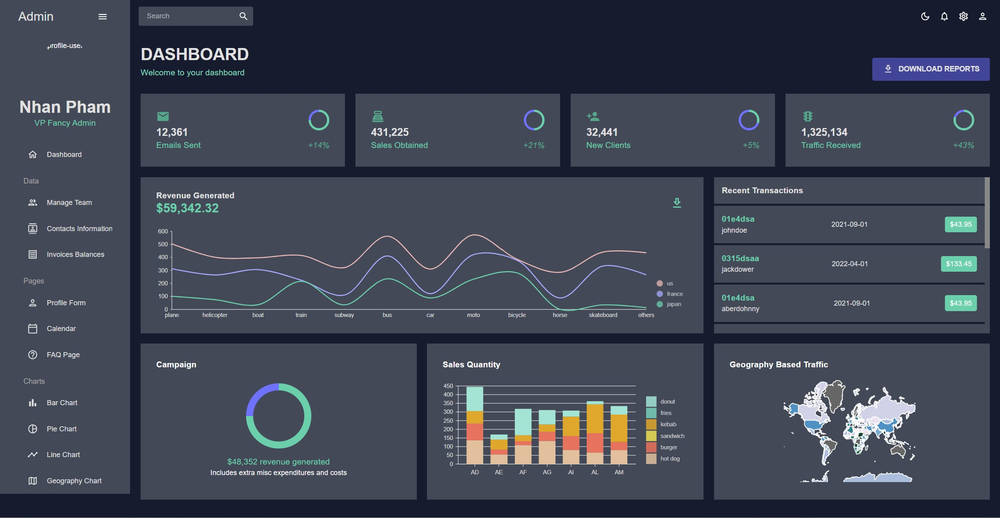
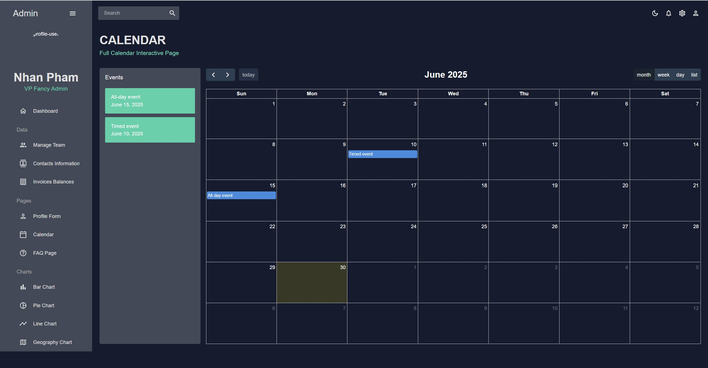
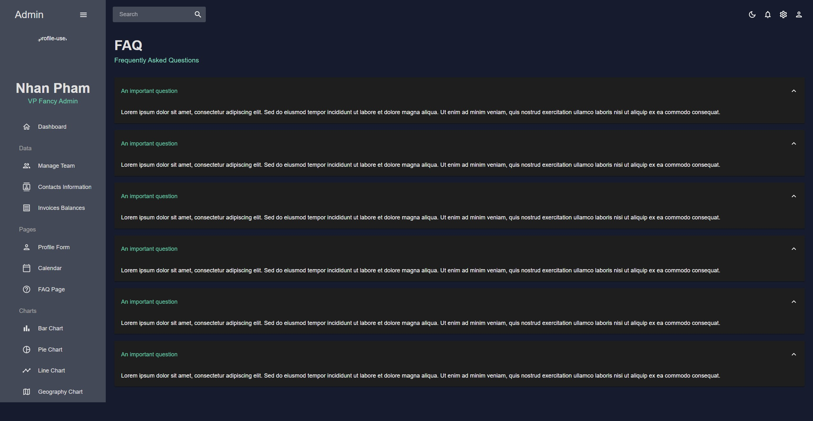
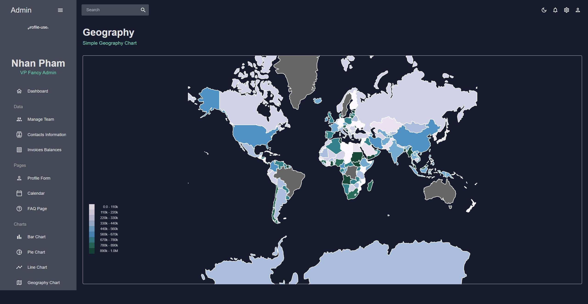
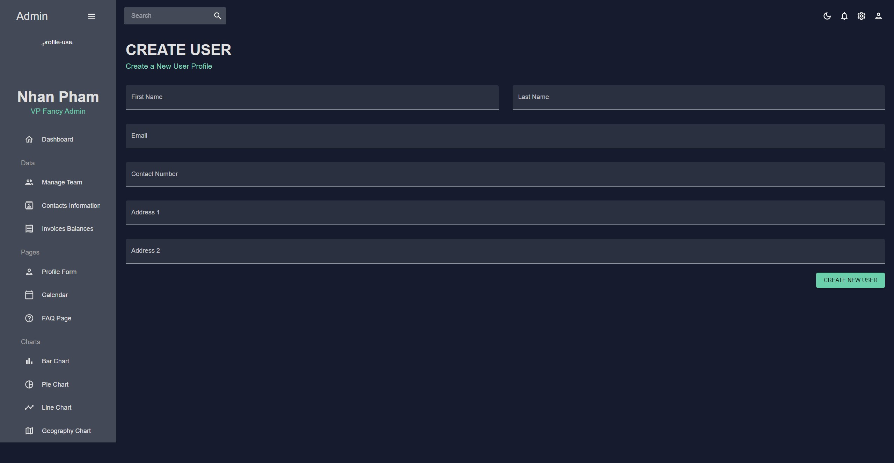
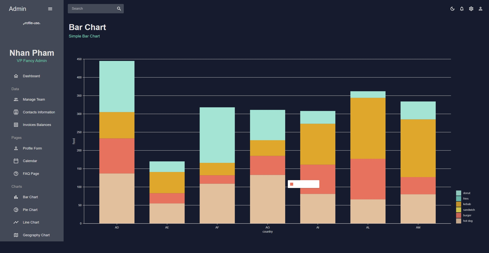
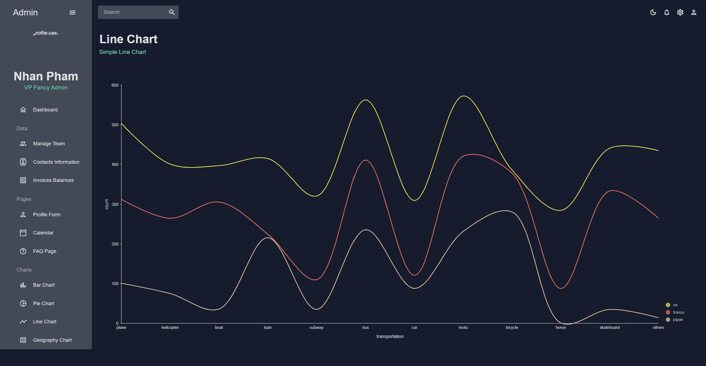
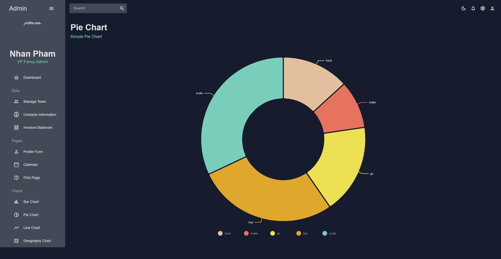

<div align="justify">

# <div align="center">Admin Dashboard</div>

A modern, responsive admin dashboard built with React, Material-UI, and Vite. This dashboard provides comprehensive data visualization and management capabilities with a clean, professional interface supporting both light and dark themes.



## 🚀 Features

### Dashboard & Analytics

- **Interactive Dashboard** - Overview with key metrics and statistics
- **Data Visualization** - Multiple chart types (Bar, Line, Pie, Geography)
- **Progress Tracking** - Visual progress indicators and stat boxes
- **Real-time Data** - Dynamic data updates and transactions

### Data Management

- **Team Management** - View and manage team members
- **Contact Management** - Comprehensive contact information system
- **Invoice Management** - Track and manage invoices with data grid
- **User Forms** - Create and edit user profiles with validation

### User Interface

- **Responsive Design** - Works seamlessly across desktop and mobile devices
- **Dark/Light Theme** - Toggle between dark and light modes
- **Modern UI Components** - Built with Material-UI for consistency
- **Interactive Sidebar** - Collapsible navigation with icons
- **Professional Topbar** - Clean header with user controls

### Additional Features

- **Calendar Integration** - Full calendar functionality with events
- **FAQ Section** - Expandable frequently asked questions
- **Geographic Visualization** - World map with data overlays
- **Form Validation** - Robust form handling with Formik and Yup

<table>
    <tr>
        <td align="center">Calendar Integration</td>
        <td align="center">FAQ Section</td>
    </tr>
    <tr>
        <td align="center">
            
        </td>
        <td align="center">
            
        </td>
    </tr>
    <tr>
        <td align="center">Geography</td>
        <td align="center">Form Validation</td>
    </tr>
    <tr>
        <td align="center">
            
        </td>
        <td align="center">
            
        </td>
    </tr>
</table>

## 🛠️ Technologies Used

### Frontend Framework

- **React 19.1.0** - Modern JavaScript library for building user interfaces
- **Vite** - Fast build tool and development server
- **React Router DOM** - Client-side routing

### UI Libraries

- **Material-UI (MUI)** - React components implementing Google's Material Design
- **Emotion** - CSS-in-JS library for styling
- **React Pro Sidebar** - Professional sidebar component

### Data Visualization

- **Nivo** - Rich set of data visualization components
  - Bar charts
  - Line charts
  - Pie charts
  - Geographic maps

### Form Management

- **Formik** - Build forms without tears
- **Yup** - JavaScript schema validation

### Calendar

- **FullCalendar** - Full-featured calendar component

### Development Tools

- **ESLint** - Code linting and quality assurance
- **React SWC** - Fast JavaScript/TypeScript compiler

## 📦 Installation and Setup

### Prerequisites

- Node.js (version 16 or higher)
- npm or yarn package manager

### Installation Steps

1. **Clone the repository**

   ```bash
   git clone <repository-url>
   cd Admin-Dashboard
   ```

2. **Install dependencies**

   ```bash
   npm install
   ```

3. **Start the development server**

   ```bash
   npm run dev
   ```

4. **Open your browser**
   Navigate to `http://localhost:5173` to view the application

### Available Scripts

- `npm run dev` - Start development server
- `npm run build` - Build for production
- `npm run preview` - Preview production build
- `npm run lint` - Run ESLint for code quality

## 🎯 Usage Examples

### Navigation

- Use the sidebar to navigate between different sections
- Toggle the sidebar collapse/expand using the hamburger menu
- Switch between light and dark themes using the theme toggle

### Dashboard Overview

- View key metrics and statistics on the main dashboard
- Interact with charts by hovering for detailed information
- Monitor recent transactions and activities

### Data Management

- **Team**: Add, edit, and manage team member information
- **Contacts**: Maintain a comprehensive contact database
- **Invoices**: Track financial transactions with sortable data grid
- **Forms**: Create new user profiles with validated input fields

### Data Visualization

- **Bar Charts**: Compare data across categories
- **Line Charts**: Track trends over time
- **Pie Charts**: View data distribution
- **Geography**: Visualize data on world maps

<table>
    <tr>
        <td align="center">Bar Charts</td>
        <td align="center">Line Charts</td>
    </tr>
    <tr>
        <td align="center">
            
        </td>
        <td align="center">
            
        </td>
    </tr>
    <tr>
        <td align="center">Pie Charts</td>
        <td align="center">Geography</td>
    </tr>
    <tr>
        <td align="center">
            
        </td>
        <td align="center">
            
        </td>
    </tr>
</table>

## 📁 Project Structure

```
src/
├── components/          # Reusable UI components
│   ├── BarChart.jsx    # Bar chart component
│   ├── LineChart.jsx   # Line chart component
│   ├── PieChart.jsx    # Pie chart component
│   ├── GeographyChart.jsx # Map visualization
│   ├── Header.jsx      # Page headers
│   ├── ProgressCircle.jsx # Progress indicators
│   └── StatBox.jsx     # Statistics display
├── scenes/             # Page components
│   ├── dashboard/      # Main dashboard
│   ├── team/          # Team management
│   ├── contacts/      # Contact management
│   ├── invoices/      # Invoice tracking
│   ├── form/          # User forms
│   ├── calendar/      # Calendar functionality
│   ├── faq/           # FAQ section
│   ├── bar/           # Bar chart page
│   ├── pie/           # Pie chart page
│   ├── line/          # Line chart page
│   ├── geography/     # Geographic visualization
│   └── global/        # Global components (Sidebar, Topbar)
├── data/              # Mock data and constants
├── assets/            # Static assets
├── theme.js           # Theme configuration
└── App.jsx            # Main application component
```

## 🎨 Customization

### Themes

The application supports both light and dark themes. Theme configuration is managed in `src/theme.js`. You can customize:

- Color palettes
- Typography
- Component styling
- Breakpoints

### Adding New Pages

1. Create a new component in `src/scenes/`
2. Add the route in `App.jsx`
3. Update the sidebar navigation in `src/scenes/global/Sidebar.jsx`

### Data Integration

Replace mock data in `src/data/mockData.js` with real API calls:

- Update data fetching logic in components
- Implement proper error handling
- Add loading states

## 🤝 Contributing

We welcome contributions to improve the Admin Dashboard! Here's how you can help:

### Getting Started

1. Fork the repository
2. Create a feature branch (`git checkout -b feature/amazing-feature`)
3. Make your changes
4. Commit your changes (`git commit -m 'Add some amazing feature'`)
5. Push to the branch (`git push origin feature/amazing-feature`)
6. Open a Pull Request

### Contribution Guidelines

- Follow the existing code style and formatting
- Write clear, descriptive commit messages
- Update documentation if needed
- Test your changes thoroughly
- Ensure ESLint passes without errors

### Code Standards

- Use functional components with hooks
- Follow React best practices
- Maintain consistent naming conventions
- Add comments for complex logic
- Keep components focused and reusable

## 📄 License

This project is licensed under the MIT License - see the [LICENSE](LICENSE) file for details.

## 👤 Author

**Nhan Pham Thanh**

- GitHub: [@NhanPhamThanh-IT](https://github.com/NhanPhamThanh-IT)
- Email: ptnhanit230104@gmail.com

## 🙏 Acknowledgments

- Material-UI team for the excellent component library
- Nivo team for the beautiful data visualization components
- React community for the amazing ecosystem
- FullCalendar for the comprehensive calendar solution

## 📞 Support

If you have any questions or need help with the project:

1. Check the [FAQ section](src/scenes/faq) in the application
2. Open an issue on GitHub
3. Contact the author directly

---

⭐ If you found this project helpful, please give it a star on GitHub!

</div>
